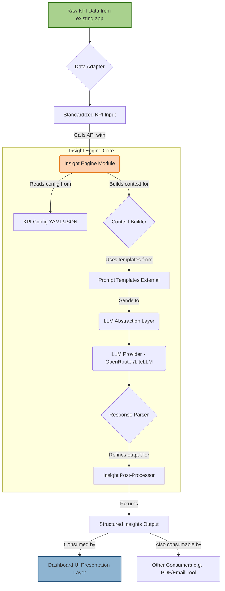

# App Architecture: AI Insight KPI Evaluator

This document outlines the architectural design for the AI Insight KPI Evaluator module, emphasizing its reusability and integration points within the Telecom KPI Dashboard project. It is designed to complement the `Insight KPI Evaluator – Requirements Document` by detailing the structural and technical considerations for implementation.

## 1. Core Architectural Principles

The AI Insight KPI Evaluator is architected around the following principles to ensure reusability, maintainability, and effective integration:

*   **Strict Separation of Concerns:** Clear boundaries between data acquisition, insight generation logic, and presentation.
*   **Standardized Interfaces:** Well-defined input and output formats for the Insight Engine module.
*   **Configurability:** Externalized configuration for KPI definitions, thresholds, and prompting strategies.
*   **LLM Abstraction:** A flexible layer to allow swapping between different Large Language Model (LLM) providers.

## 2. High-Level System Diagram



## 3. Module Breakdown & Interfaces

### 3.1 Data Adapter (`data_adapter.py` / within main script)

*   **Role:** Transforms the existing dashboard's raw KPI data into the `Standardized KPI Input` format required by the `Insight Engine`. This insulates the `Insight Engine` from specific data source structures.
*   **Input:** Existing generated KPI data (e.g., in-memory Python dictionaries or DataFrames).
*   **Output:** `List[Dict]` adhering to the `Standardized KPI Input` format (see 3.2).
*   **Hackathon Note:** For the MVP, this can be a simple function within the main application script that maps existing data fields to the expected input structure.

### 3.2 Standardized KPI Input Format

This is the common interface contract for feeding data into the `Insight Engine`.

```python
# Example structure for a single KPI within the input list
kpi_entry = {
    "kpi_name": "string",            # e.g., "Network Availability"
    "current_value": float,          # e.g., 99.77
    "prior_value": float,            # e.g., 99.50 (from previous period)
    # Note: 'peer_avg' and 'industry_avg' can be obtained from KPI Config if dynamic sourcing is not ready
    # "peer_avg": float,             # Optional: e.g., 99.70 (if passed directly)
    # "industry_avg": float,         # Optional: e.g., 99.65 (if passed directly)
}
```

*   **Key Consideration:** The `Insight Engine` will enrich this data with meta-information (thresholds, direction, peer/industry averages) from the `KPI Config`.

### 3.3 KPI Configuration (`kpi_config.yaml`)

*   **Role:** Externalizes KPI metadata, performance thresholds, and mock benchmark data. This allows dynamic adjustments without code changes.
*   **Format:** YAML file.
*   **Contents:**
    *   `name`: (string) Matches `kpi_name` in `Standardized KPI Input`.
    *   `unit`: (string) e.g., "%", "ms", "hours".
    *   `direction`: (string) Critical for LLM logic. Values: `"higher_is_better"`, `"lower_is_better"`, `"neutral"`.
    *   `threshold_low`: (float, optional) Lower acceptable bound.
    *   `threshold_high`: (float, optional) Upper acceptable bound.
    *   `mock_peer_avg`: (float, optional) Mock data for peer benchmarking (for hackathon).
    *   `mock_industry_avg`: (float, optional) Mock data for industry benchmarking (for hackathon).

*   **Example `kpi_config.yaml` snippet:**

    ```yaml
    kpis:
      - name: Network Availability
        unit: "%"
        direction: higher_is_better
        threshold_low: 99.60
        threshold_high: 100.0
        mock_peer_avg: 99.70
        mock_industry_avg: 99.65
      - name: Latency
        unit: "ms"
        direction: lower_is_better
        threshold_low: 0.0
        threshold_high: 40.0
        mock_peer_avg: 45.0
        mock_industry_avg: 52.0
    ```

### 3.4 LLM Abstraction Layer (`llm_interface.py`)

*   **Role:** Provides a unified interface for interacting with various LLM providers, abstracting away their specific API calls.
*   **Provider:** Utilizes `litellm` for seamless integration with `OpenRouter.ai` (and potential future providers).
*   **Key Function:**
    ```python
    class LLMAbstraction:
        def __init__(self, api_key: str, default_model: str)
        def generate_text(self, prompt: str, model: str = None) -> str
    ```
*   **Configuration:** API key loaded via environment variables or direct parameter.
*   **Robustness:** Includes basic error handling for LLM API calls.

### 3.5 Prompt Templates (External files or within `insight_engine.py`)

*   **Role:** Stores structured prompts that guide the LLM's insight generation. Separating these allows easy iteration and tuning without changing core logic.
*   **Content:** Templates for generating:
    *   Overall summary (e.g., "Network Health: Overall trends...").
    *   Individual KPI insights (e.g., "Latency: ...").
*   **Strategy:** Emphasize clear instructions for analysis, comparison (prior, peer, industry), and classification (Good/Watch/Critical). Request JSON output from LLM for easier parsing.

### 3.6 Insight Engine Core (`insight_engine.py`)

*   **Role:** The central module for processing KPI data and generating natural-language insights. Designed to be standalone and reusable.
*   **Public Function:**
    ```python
    def generate_insights(kpi_data: List[Dict], kpi_config: Dict, llm_client: LLMAbstraction) -> Dict:
        # kpi_data: List of standardized KPI dictionaries.
        # kpi_config: Dictionary loaded from kpi_config.yaml.
        # llm_client: An instance of LLMAbstraction.
        # Returns: Structured Insights Output dictionary.
    ```
*   **Internal Workflow:**
    1.  **Enrichment:** Merges `kpi_data` with relevant `kpi_config` entries (especially `direction`, thresholds, mock benchmarks).
    2.  **Calculation:** Computes performance metrics (e.g., % change from prior, status against thresholds, comparison vs. peer/industry).
    3.  **Context Building:** Dynamically constructs a detailed, factual prompt context string/JSON for the LLM based on calculated metrics for all relevant KPIs.
    4.  **LLM Call:** Invokes `llm_client.generate_text()` with the generated prompt.
    5.  **Response Parsing:** Interprets the raw LLM response (ideally JSON) into structured data.
    6.  **Post-Processing:** Refines insights for clarity, conciseness, and adherence to desired output format (e.g., ensuring bullet points, adding "Action Required" phrases).

### 3.7 Structured Insights Output Format

The expected output from the `Insight Engine` (consumed by the Dashboard UI and other systems).

```python
insights_output = {
    "overall_summary": "string", # A concise narrative summarizing the overall state for the subject area/tab.
    "kpi_details": [
        {
            "kpi_name": "string",
            "status": "string",  # e.g., "Good", "Watch", "Critical" (derived from internal logic)
            "bullets": [
                "string", # Bullet point insights for this specific KPI
                "string"
            ]
        }
    ]
}
```

## 4. Integration with Dashboard UI (Presentation Layer)

*   The dashboard's HTML/CSS (`Verizon_Pitch_Theme.html` or similar) will render the `Structured Insights Output`.
*   A dedicated UI element (e.g., a panel at the top of each tab) will display the `overall_summary`.
*   Optionally, detailed KPI insights (`kpi_details`) can be expanded or integrated near their respective KPI tiles.

## 5. Hackathon MVP Scope Alignment

The architecture directly supports the MVP goals outlined in `requirements.md`:

*   `Insight Engine supporting basic change + benchmark deltas`: Covered by `Insight Engine Core` and its calculations.
*   `Hardcoded mock benchmark data`: Managed within `kpi_config.yaml`.
*   `Narrative summary at top of 2 subject area tabs`: Achieved by calling `generate_insights` per tab and displaying `overall_summary`.
*   `YAML or dataframe-based KPI config`: `kpi_config.yaml` is the solution.
*   `Reusable insight generator function with clean interface`: The `generate_insights` function in `insight_engine.py`.

