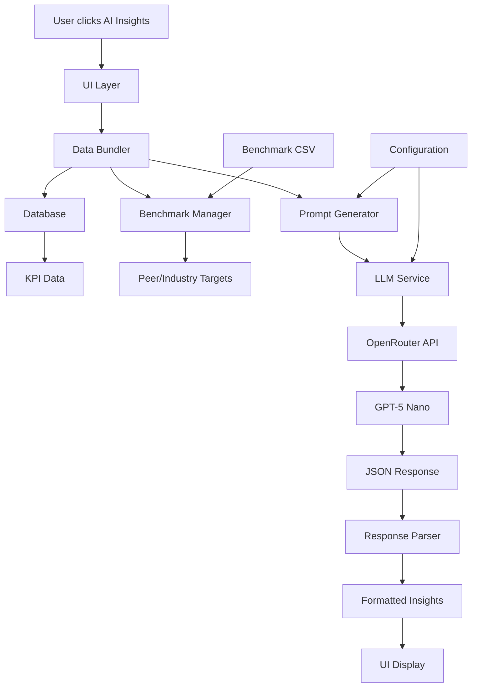

# AI Insights Architecture

## Overview
The AI Insights feature provides intelligent analysis of KPI data using GPT-5 Nano via OpenRouter, delivering actionable insights and recommendations for telecommunications performance optimization.

## Core Principles

### 1. **Strict Separation of Concerns**
- **Data Layer**: Handles KPI data retrieval and benchmark management
- **LLM Layer**: Manages API calls and response parsing
- **UI Layer**: Renders insights and handles user interactions
- **Configuration Layer**: Manages prompts and settings

### 2. **Standardized Interfaces**
- Consistent data formats across all modules
- Well-defined API contracts between components
- Clear error handling and logging

### 3. **Configurability**
- YAML-based prompt configuration
- Adjustable LLM parameters (temperature, tokens, model)
- Benchmark data stored in CSV/SQLite for easy updates

### 4. **LLM Abstraction**
- OpenRouter integration for model flexibility
- JSON-structured responses for reliable parsing
- Fallback mechanisms for API failures

## System Architecture



## Module Breakdown

### 1. **Data Adapter (`ai_insights_data_bundler.py`)**
- **Purpose**: Transforms raw KPI data into standardized format
- **Input**: KPI data from database, benchmark targets
- **Output**: Structured data bundle for LLM analysis
- **Key Functions**:
  - `bundle_kpi_data_for_insights()`: Creates analysis-ready data
  - `generate_ai_prompt()`: Constructs LLM prompts
  - `load_prompt_config()`: Loads YAML configuration

### 2. **Standardized KPI Input Format**
```python
{
    "kpi_name": "network_availability",
    "current_value": 99.8,
    "prior_value": 99.7,
    "delta_direction": "improving",
    "peer_avg": 99.2,
    "industry_avg": 98.8,
    "unit": "%",
    "direction": "higher"
}
```

### 3. **KPI Configuration (`ai_insights_prompts.yaml`)**
- **System prompts**: Define AI behavior and output format
- **Subject area templates**: Customized prompts for each KPI category
- **Global settings**: Model parameters and response formatting

### 4. **LLM Abstraction Layer (`llm_service.py`)**
- **Purpose**: Handles all LLM interactions
- **Features**:
  - OpenRouter API integration
  - JSON response formatting
  - Error handling and retry logic
  - Response parsing and validation

### 5. **Prompt Templates**
- **Network Performance**: Focus on reliability and optimization
- **Customer Experience**: Emphasis on satisfaction and retention
- **Revenue & Financial**: Growth and profitability analysis
- **Usage & Adoption**: Service utilization and engagement
- **Operations**: Efficiency and process optimization

### 6. **Insight Engine Core**
- **Input Processing**: Validates and structures KPI data
- **Context Generation**: Creates comprehensive analysis context
- **Response Parsing**: Extracts structured insights from LLM
- **Formatting**: Prepares insights for UI display

### 7. **Structured Insights Output Format**
```json
{
    "summary": "Executive summary of key findings",
    "key_insights": ["Important observation 1", "Important observation 2"],
    "trends": ["Significant trend 1", "Significant trend 2"],
    "recommended_actions": ["Actionable recommendation 1", "Actionable recommendation 2"]
}
```

## Data Flow

1. **User Interaction**: Click "🤖 AI Insights" button
2. **Data Retrieval**: Fetch current KPI values and benchmarks
3. **Context Building**: Bundle data with peer/industry comparisons
4. **Prompt Generation**: Create subject-specific analysis prompt
5. **LLM Call**: Send to GPT-5 Nano via OpenRouter
6. **Response Processing**: Parse JSON and validate structure
7. **UI Rendering**: Display formatted insights with actions

## Configuration Management

### LLM Settings (`config.secrets.yaml`)
```yaml
llm:
  provider: "openrouter"
  api_key: "your-key"
  model: "openai/gpt-5-nano"
  temperature: 0.7
  max_tokens: 1000
```

### Prompt Configuration (`ai_insights_prompts.yaml`)
- **System prompts**: Define AI behavior
- **Subject templates**: Customized for each KPI category
- **Global parameters**: Model settings and formatting

### Benchmark Data (`data/benchmark_targets.csv`)
- **Peer averages**: Industry competitor benchmarks
- **Industry averages**: Sector-wide performance standards
- **Thresholds**: Green/yellow/red performance indicators

## Error Handling

### API Failures
- **Retry logic**: Automatic retry on transient failures
- **Fallback responses**: Graceful degradation when LLM unavailable
- **User feedback**: Clear error messages and recovery options

### Data Issues
- **Validation**: Check for missing or invalid KPI data
- **Defaults**: Use reasonable defaults for missing benchmarks
- **Logging**: Comprehensive error logging for debugging

## Performance Considerations

### Optimization Strategies
- **Caching**: Store LLM responses to avoid redundant calls
- **Async processing**: Non-blocking UI during analysis
- **Response streaming**: Progressive insight display

### Resource Management
- **Token limits**: Control API costs and response size
- **Rate limiting**: Prevent API quota exhaustion
- **Memory efficiency**: Optimize data structures and processing

## Security & Privacy

### API Key Management
- **Secure storage**: Keys in `.gitignore` protected files
- **Environment variables**: Alternative configuration method
- **Access control**: Restrict key usage and permissions

### Data Protection
- **Local processing**: KPI data stays within application
- **No PII**: Ensure no personal data sent to LLM
- **Audit logging**: Track API usage and data access

## Future Enhancements

### Planned Features
- **Multi-model support**: Switch between different LLM providers
- **Custom insights**: User-defined analysis criteria
- **Historical analysis**: Trend analysis across time periods
- **Action tracking**: Monitor implementation of recommendations

### Scalability Considerations
- **Batch processing**: Analyze multiple KPIs simultaneously
- **Caching layer**: Redis for response caching
- **Load balancing**: Multiple API endpoints for reliability

